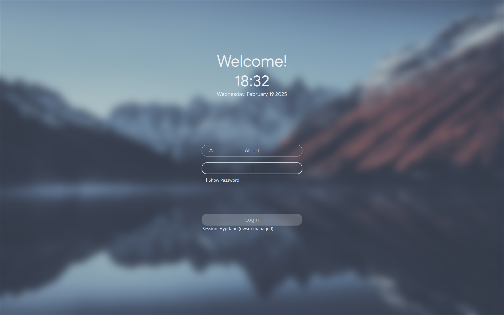
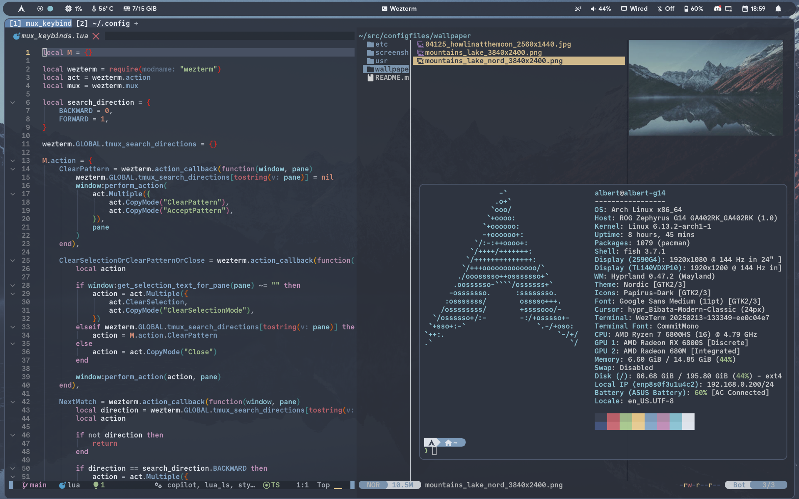
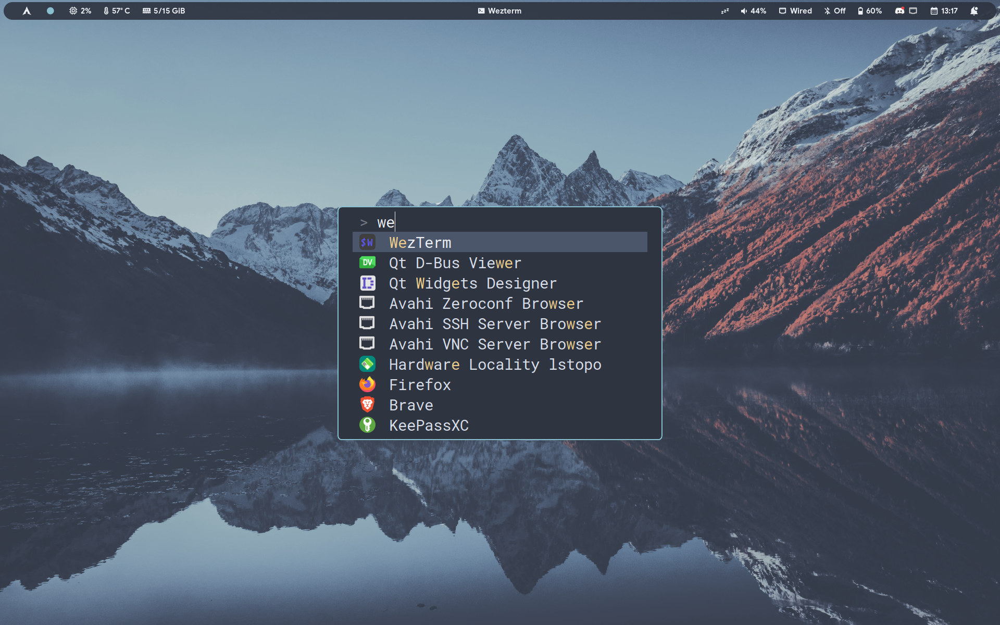
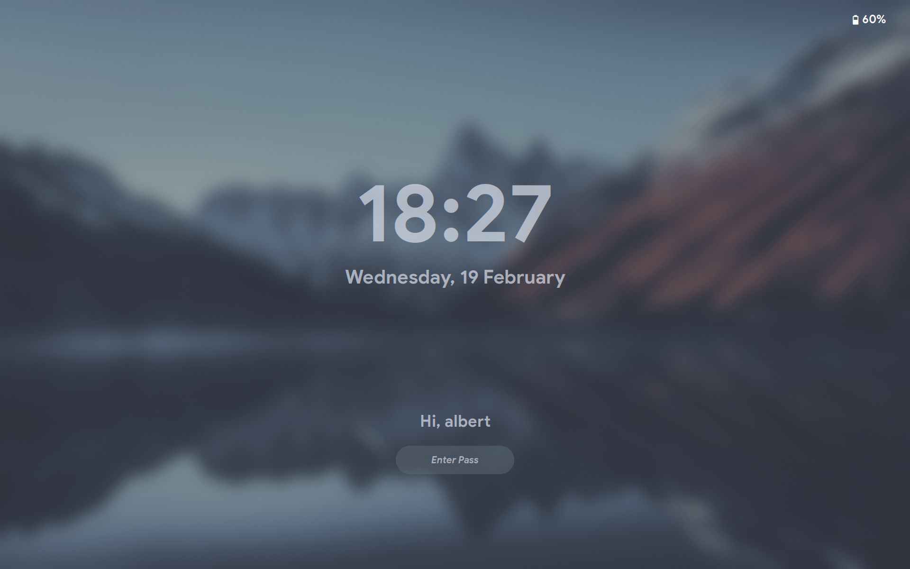
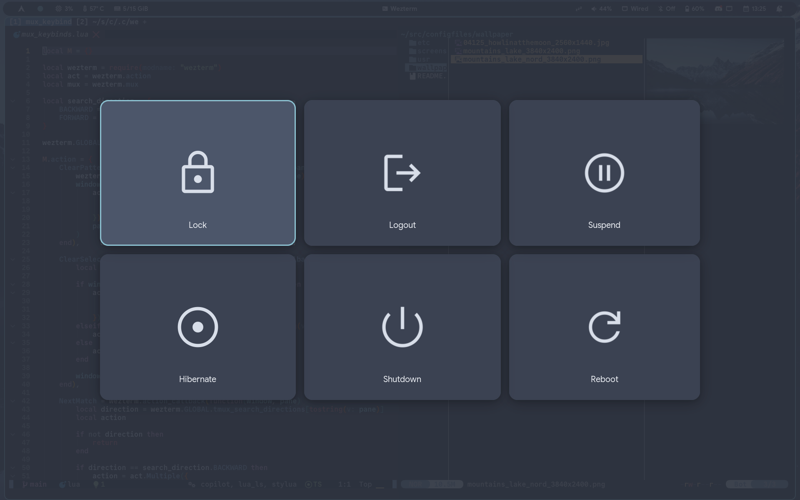

These are my personal configuration files for my Arch/Hyprland setup.

- **WM**: [Hyprland](https://github.com/hyprwm/Hyprland)
- **Terminal**: [Wezterm](https://github.com/wezterm/wezterm)
- **Launcher**: [Fuzzel](https://codeberg.org/dnkl/fuzzel)
- **Bar/Widgets/Notifications**: [Hyprpanel](https://github.com/Jas-SinghFSU/HyprPanel)
- **Lockscreen**: [Hyprlock](https://github.com/hyprwm/hyprlock)
- **Logout screen**: [Wlogout](https://github.com/ArtsyMacaw/wlogout)
- **Wallpaper manager**: [Hyprpaper](https://github.com/hyprwm/hyprpaper)
- **Idle manager**: [Hypridle](https://github.com/hyprwm/hypridle)
- **Color scheme**: [Nordfox](https://github.com/EdenEast/nightfox.nvim)
- **Fonts**: Google Sans, Commit Mono, Roboto Mono
- **Icons**: [Papirus](https://github.com/PapirusDevelopmentTeam/papirus-icon-theme)
- **Cursor**: [macOs](https://github.com/ful1e5/apple_cursor), [Bibata](https://github.com/ful1e5/Bibata_Cursor)
- **GTK Theme**: [Nordic](https://github.com/EliverLara/Nordic)
- **Shell**: [Fish](https://github.com/fish-shell/fish-shell)

## Screenshots

<div align="center">
  
  
  
  
  
</div>

## Installation

1. Install the dependencies using [`paru`](https://github.com/Morganamilo/paru) (I may have missed some, but these should be most of them):

```bash
paru -S jq hyprland hyprland-qtutils hyprshot hyprpicker ags-hyprpanel-git wezterm-git hyprpaper hypridle hyprlock wlogout python3 playerctl ttf-sourcecodepro-nerd ttf-noto-nerd otf-font-awesome blueman network-manager-applet wtype wlr-randr nwg-look wlsunset xdg-desktop-portal-hyprland udisks2 gvfs hyprpolkitagent wget sddm brightnessctl uwsm clipse fuzzel nordic-theme-git ttf-google-sans ttf-roboto-mono-nerd nordic-theme-git
```

2. Clone the repo

```sh
git clone https://github.com/Albert24GG/configfiles
```

3. Copy the config files

```bash
cd ./configfiles/.config

cp -r hypr wezterm fuzzel hyprpanel wlogout uwsm ~/.config
```

4. For monitors config to work, the script from `./configfiles/usr/local/bin/update-monitors.sh` should be copied to `/usr/local/bin`:

```bash
sudo cp ./configfiles/usr/local/bin/update-monitors.sh /usr/local/bin
```

The configurations are done in the file `.config/hypr/hyprland/monitors_info.json`:

```json
{
  "monitors": [
    {
      "name": "eDP-2",
      "resolution": "1920x1200",
      "high_rr": "144",
      "low_rr": "60",
      "x": "0",
      "y": "0",
      "scale": "1"
    },
    {
      "name": "HDMI-A-1",
      "resolution": "1920x1080",
      "high_rr": "144",
      "low_rr": "60",
      "x": "1920",
      "y": "0",
      "scale": "1"
    }
  ]
}
```

For the automatic refresh rate switching on AC/battery power, the following udev rule should be copied to `/etc/udev/rules.d/`:

```bash
sudo cp ./configfiles/etc/udev/rules.d/99-update-refresh-rate.rules /etc/udev/rules.d/
sudo udevadm control --reload-rules && sudo udevadm trigger
```

5. To use the hyprcursor themes, copy the themes to `~/.local/share/icons`:

```bash
cp -r ./configfiles/.local/share/icons/* ~/.local/share/icons/
```

For gtk and xcursor, install the themes via paru and select them in the nwg-look settings.

6. To use the sddm theme, first copy the theme to `/usr/share/sddm/themes/`:

```bash
sudo cp -r ./configfiles/usr/share/sddm/themes/eucalyptus-drop /usr/share/sddm/themes/
```

Then, edit the file `/etc/sddm.conf.d/sddm.conf` and change the `Current` value to `hyprland`:

```ini
[Theme]
Current=eucalyptus-drop
```
