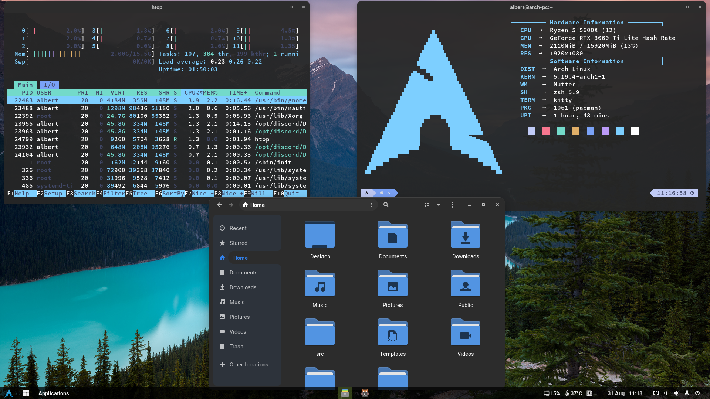
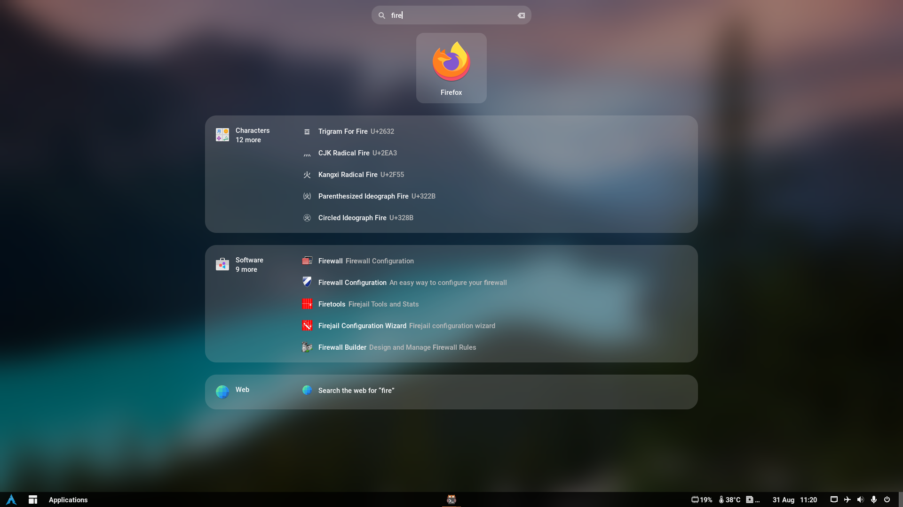

This are the dotfiles that I currently use in my arch build.
# AwesomeWm
## Screenshots

<div align="center">
  
  
</div>

## Installation
1. ```git clone https://github.com/Albert24GG/configfiles```
2. You may first want to take a look and edit `.config/awesome/configuration/user-variables.lua`. For the current configuration, these are all the dependencies: 

```sh
paru -S awesome-git kitty rofi picom-ibhagwan-git thunar x11-emoji-picker xidlehook gnome-calculator firefox networkmanager ttf-sourcecodepro-nerd nerd-fonts-liberation-mono blueman xss-lock papirus-icon-theme alsa-utils playerctl brightnessctl i3lock-color betterlockscreen maim xclip polkit-gnome redshift udev-notify-git udisks2 gvfs
```
3. Optional packages that I would recommend using:
- arandr and autorandr 
- easyeffects/pavucontrol 
- lxappearance-gtk3
- mpv
- nvidia-settings (also enable **_Force Composition Pipeline_** if there is any screen tearing - save the config in `/etc/X11/xorg.conf.d/20-nvidia-antitear.conf` and add the following line to the Section "Device"(the one that contains the name of the gpu)
`Option "RegistryDwords" "EnableBrightnessControl=1"`)

**Gtk theme**: Orchis-dark

**Display manager**:
- LightDM with a webkit2 theme ([glorious theme](https://github.com/manilarome/lightdm-webkit2-theme-glorious) or [litarvan theme](https://github.com/Litarvan/lightdm-webkit-theme-litarvan)).
- SDDM with the [sugar-candy theme](https://store.kde.org/p/1312658/)

# Gnome

## Screenshots

<div align="center">
  
  
</div>

## Theme
- Orchis-dark

## Icons
- Papirus

## Font
- Interface text: Roboto Medium
- Monospace text: Liberation Mono Regular
- Terminal: Source Code Pro Semibold / Jetbrains Mono

## Gnome-Extensions
- AppIndicator and KStatusNotifierItem Support
- Applications Menu
- ArcMenu
- Auto Move Windows
- Blur my Shell
- Dash to Panel
- Launch new instance 
- Native Window Placement
- Panel Date Format
- Unite
- Vitals
