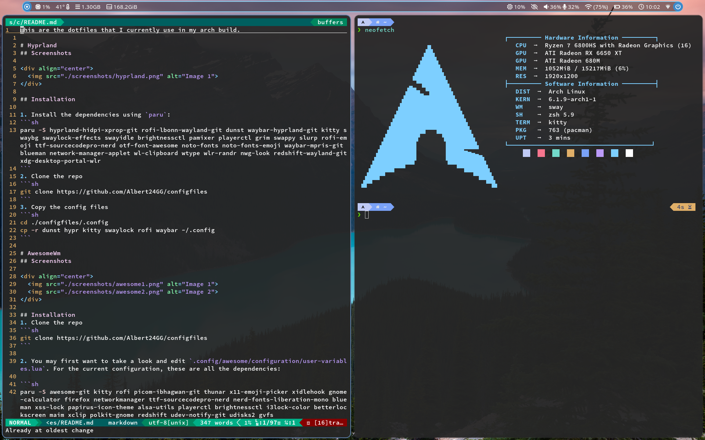

This are the dotfiles that I currently use in my arch build.

# Hyprland

## Screenshots

<div align="center">
  
</div>

## Installation

1. Install the dependencies using `paru`:

```sh
# Hyprpanel(ags) version
paru -S jq hyprland hyprland-qtutils hyprshot hyprpicke ags-hyprpanel-git kitty hyprpaper hypridle hyprlock wlogout python3 playerctl rofi-emoji ttf-sourcecodepro-nerd ttf-noto-nerd otf-font-awesome blueman network-manager-applet wl-clipboard wtype wlr-randr nwg-look wlsunset xdg-desktop-portal-hyprland udisks2 gvfs hyprpolkitagent wget cliphist sddm

# Waybar version
paru -S jq hyprland hyprland-qtutils hyprshot hyprpicker swaync waybar kitty hyprpaper hypridle hyprlock wlogout python3 playerctl rofi-emoji ttf-sourcecodepro-nerd ttf-noto-nerd otf-font-awesome ttf-weather-icons blueman network-manager-applet wl-clipboard wtype wlr-randr nwg-look wlsunset xdg-desktop-portal-hyprland udisks2 gvfs hyprpolkitagent wget cliphist swayosd-git sddm
```

2. Clone the repo

```sh
git clone https://github.com/Albert24GG/configfiles
```

3. Copy the config files

```sh
cd ./configfiles/.config
cp -r swaync hypr kitty rofi waybar wlogout ~/.config
```

4. Enable service needed by swayosd

```sh
sudo systemctl enable --now swayosd-libinput-backend.service
```

5. Optionally, enable automatic refresh rate switching on AC/battery power. Also, the config file at `.config/hypr/monitors.conf` should be edited according to the user's needs. (see output of `hyprctl monitors`)

```sh
sudo cp ./configfiles/etc/udev/rules.d/99-update-refresh-rate.rules /etc/udev/rules.d/
sudo cp ./configfiles/usr/local/bin/update-monitors.sh /usr/local/bin
sudo udevadm control --reload-rules && sudo udevadm trigger
```

# AwesomeWm

## Screenshots

<div align="center">
  
  
</div>

## Installation

1. Clone the repo

```sh
git clone https://github.com/Albert24GG/configfiles
```

2. You may first want to take a look and edit `.config/awesome/configuration/user-variables.lua`. For the current configuration, these are all the dependencies:

```sh
paru -S awesome-git kitty rofi picom thunar x11-emoji-picker xidlehook gnome-calculator firefox networkmanager ttf-sourcecodepro-nerd ttf-noto-nerd blueman xss-lock papirus-icon-theme alsa-utils playerctl brightnessctl i3lock-color betterlockscreen maim xclip polkit-gnome redshift udisks2 gvfs
```

3. Copy the config files

```sh
cd ./configfiles/.config
cp -r awesome kitty picom rofi ~/.config
```

4. Optional packages that I would recommend using:

- arandr and autorandr
- easyeffects/pavucontrol
- lxappearance-gtk3
- mpv
- nvidia-settings (also enable **_Force Composition Pipeline_** if there is any screen tearing - save the config in `/etc/X11/xorg.conf.d/20-nvidia-antitear.conf` and add the following line to the Section "Device"(the one that contains the name of the gpu)
  `Option "RegistryDwords" "EnableBrightnessControl=1"`)

**Gtk theme**: Orchis-dark

**Display manager**:

- LightDM with a webkit2 theme ([glorious theme](https://github.com/manilarome/lightdm-webkit2-theme-glorious) or [litarvan theme](https://github.com/Litarvan/lightdm-webkit-theme-litarvan)).
- SDDM with the [sugar-candy theme](https://store.kde.org/p/1312658/)

# Gnome

## Screenshots

<div align="center">
  
  
</div>

## Theme

- Orchis-dark

## Icons

- Papirus

## Font

- Interface text: Roboto Medium
- Monospace text: Liberation Mono Regular
- Terminal: Source Code Pro Semibold / Jetbrains Mono

## Gnome-Extensions

- AppIndicator and KStatusNotifierItem Support
- Applications Menu
- ArcMenu
- Auto Move Windows
- Blur my Shell
- Dash to Panel
- Launch new instance
- Native Window Placement
- Panel Date Format
- Unite
- Vitals
